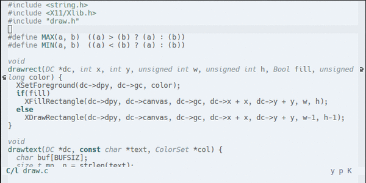

# Ambience <WIP>

Ambience is a collection of minimally designed theme for Emacs.

### Requirement
Emacs (>= 24.0)

### Themes

- **jadoroso** Colors to match your Gyokuro tea
- **sucubo** A somewhat minimal purplish theme
- **tajakareo** Red, green, and yellow like Thai curry.
- **verda** A very dark and minimal green theme.

### Screenshot

### TODO:
1. Simplify theme.